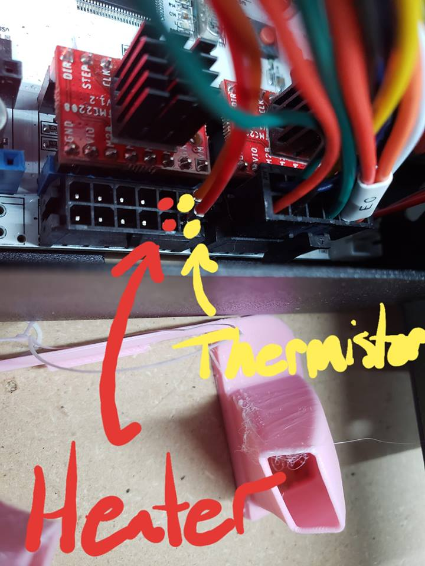

# A10M Chimera Conversion Guide

This guide will help you convert printer to use a chimera (2 in 2 out) style hotend. 

**I am not responsible if you screw something up or burn your house down.**

# Parts
  * Chimera (24V) w/ 2x Heater Cartridges and Thermistor 
  
# Mount the Chimera
  * Remove the stock hotend
  * Print the [mount](https://www.thingiverse.com/thing:3488156): 
  * [Assemble the Chimera](https://e3d-online.dozuki.com/Guide/Chimera+Assembly/77?lang=en)
  * Install the mount on the carriage
  * [Level the nozzles](https://www.youtube.com/watch?v=7Bv5rPmiO0Q)

# Wiring the Chimera
At this point. You have your Chimera mounted and none of the wires connected.
  * For the E0 (Left) heater and thermistor, use the same wires from the breakout board
  * For the E1 (Right) heater and thermistor, connect them to main board as shown in the picture below
    
    
# Updating Firmware
  * Clone 1.1.8
  * Replace files 
  * Flash it

# Setting up the Chimera
  * Octoprint
  * PID Autotune
  * X Offset